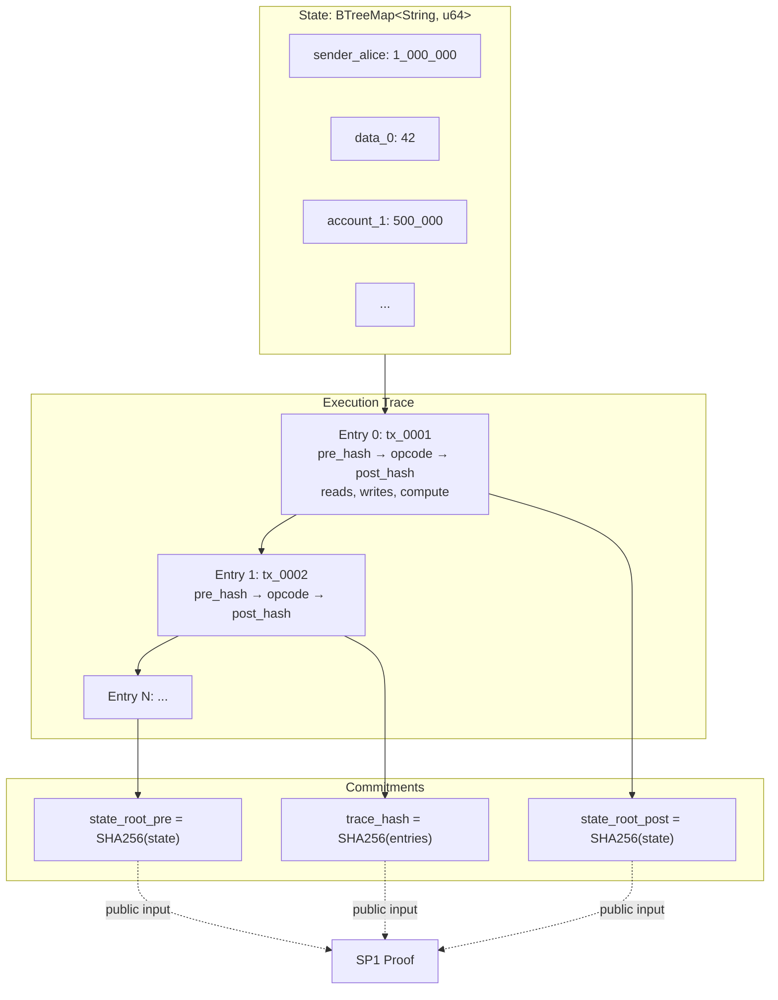

# CatalystSVM
Latency-aware ZK batch proving for SVM-based blockchains using SP1, adaptive batching policies, and measurable latency-throughput tradeoffs

## How It Works

CatalystSVM breaks the per-transaction proving bottleneck using adaptive ZK batch aggregation:

1. **Adaptive Batching Policy** - Ingest SVM transactions and hold them in a queue. A policy engine decides when to seal a batch using count thresholds, time thresholds, or dynamic latency feedback. Unlike fixed strategies, the adaptive policy shrinks batch size when latency approaches the budget and grows it during low traffic

2. **Deterministic Off-Chain Execution** - Sealed batches execute deterministically against a `BTreeMap` state model with a 4-opcode instruction set (Transfer, SetData, Increment, Noop). Each transaction produces a structured trace entry recording pre/post state hashes, accounts read/written, and compute used

3. **SP1 ZK Proof Generation** - The execution trace feeds into [SP1](https://github.com/succinctlabs/sp1) (Succinct's RISC-V zkVM). The SP1 guest program re-executes all transactions inside the zkVM, recomputes state roots and trace hashes, and asserts they match the claimed values. Output is a compressed SNARK proof (~1.2 MB, ~30s on CPU)

4. **Cryptographic Verification** - A verifier node loads the proof, cryptographically verifies it via SP1 SDK, validates public inputs against the trace, and checks state continuity across batches. Successful verification produces an attestation anchoring the batch to a state chain

## Architecture


### Protocol Flow

```mermaid
sequenceDiagram
    autonumber
    
    participant User as User/dApp
    participant RPC as Validator RPC<br/>:8899
    participant Queue as TX Queue<br/>Vec<Transaction>
    participant Policy as Batch Policy<br/>Hybrid/Adaptive/Auto
    participant Executor as Deterministic Executor<br/>BTreeMap<String,u64>
    participant SP1Host as SP1 Prover (Host)<br/>sp1_sdk::blocking
    participant SP1Guest as SP1 zkVM (Guest)<br/>RISC-V riscv32im
    participant Disk as Proof Storage<br/>./proofs/
    participant Verifier as Verifier Node<br/>:8900
    participant Chain as State Chain

    %% Phase 1: Transaction Ingress
    rect rgb(30, 60, 90)
        Note over User,Queue: PHASE 1: TRANSACTION INGRESS
        User->>+RPC: submitTransaction(sender, program_id, instruction_data[], priority)
        RPC->>RPC: Assign tx_id = tx_00000001, timestamp
        RPC->>Queue: Enqueue Transaction
        RPC-->>-User: {tx_id: "tx_00000001", status: "pending"}
        User->>RPC: submitTransaction(...)
        RPC->>Queue: Enqueue tx_00000002..tx_0000000N
    end

    %% Phase 2: Batch Sealing
    rect rgb(40, 70, 50)
        Note over Queue,Policy: PHASE 2: BATCH SEALING
        loop Every 100ms
            Policy->>Queue: Check queue_len, oldest_wait_ms, arrival_rate
            Policy->>Policy: Evaluate: count≥10 OR wait≥5000ms?
        end
        Policy->>Policy: should_seal() = true
        Policy->>Queue: Drain N transactions
        Queue-->>Policy: tx_ids: [tx_00000001..tx_0000000N]
        Policy->>Executor: Batch{id: batch_000001, tx_ids, sealed_at}
    end

    %% Phase 3: Deterministic Execution
    rect rgb(50, 80, 60)
        Note over Executor: PHASE 3: DETERMINISTIC EXECUTION
        Executor->>Executor: Init state: BTreeMap<String, u64><br/>sender_tx_00000001: 1_000_000, ...
        Executor->>Executor: Compute state_root_pre = SHA256 merkle(sorted keys)
        loop For each transaction
            Executor->>Executor: Parse opcode: 0=Transfer, 1=SetData, 2=Increment, 3=Noop
            Executor->>Executor: Execute instruction, update state
            Executor->>Executor: Record TraceEntry{tx_id, reads, writes, compute, success}
        end
        Executor->>Executor: Compute state_root_post = SHA256 merkle(final state)
        Executor->>Executor: Compute trace_hash = merkle(entry_hashes)
        Executor-->>SP1Host: ExecutionTrace{state_root_pre, state_root_post, trace_hash, entries[]}
    end

    %% Phase 4: ZK Proof Generation
    rect rgb(80, 60, 30)
        Note over SP1Host,SP1Guest: PHASE 4: SP1 ZK PROOF GENERATION (~30 seconds)
        SP1Host->>SP1Host: Load ELF: include_bytes!("riscv32im-succinct-zkvm-elf")
        SP1Host->>SP1Host: Setup: prover.setup(elf) → ProvingKey, VerifyingKey
        SP1Host->>SP1Host: Prepare inputs: SP1Stdin.write(&trace, &txs, &initial_state)
        SP1Host->>+SP1Guest: prover.prove(&pk, stdin).compressed().run()
        
        Note over SP1Guest: Inside zkVM (RISC-V isolated execution)
        SP1Guest->>SP1Guest: sp1_zkvm::io::read() → trace, transactions, initial_state
        SP1Guest->>SP1Guest: Re-execute all transactions from scratch
        SP1Guest->>SP1Guest: Recompute state_root_pre, state_root_post, trace_hash
        SP1Guest->>SP1Guest: assert_eq!(recomputed, claimed) — panics if mismatch
        SP1Guest->>SP1Guest: sp1_zkvm::io::commit(&PublicInputs{batch_id, roots, trace_hash, tx_count})
        SP1Guest-->>-SP1Host: Execution complete
        
        SP1Host->>SP1Host: Generate STARK proof (FRI-based)
        SP1Host->>SP1Host: Compress STARK → SNARK (~1.2 MB)
        SP1Host->>SP1Host: proof_bytes = bincode::serialize(SP1ProofWithPublicValues)
        SP1Host->>Disk: Write batch_000001.proof (1.2 MB)
        SP1Host->>Disk: Write batch_000001.trace (JSON)
    end

    %% Phase 5: Verification
    rect rgb(60, 40, 80)
        Note over Disk,Chain: PHASE 5: CRYPTOGRAPHIC VERIFICATION (~1.2 seconds)
        Verifier->>Disk: Poll for new .proof files
        Disk-->>Verifier: batch_000001.proof, batch_000001.trace
        Verifier->>Verifier: bincode::deserialize → SP1ProofWithPublicValues
        Verifier->>Verifier: sp1_sdk::verify(proof, verifying_key)
        
        alt Proof cryptographically valid
            Verifier->>Verifier: Extract PublicInputs from proof.public_values
            Verifier->>Chain: Check state_root_pre == current_state_root
            Chain-->>Verifier: Match confirmed
            Verifier->>Chain: Update current_state_root = state_root_post
            Verifier->>Verifier: verified_count++
            Verifier->>Verifier: attestation = SHA256(batch_id || proof_hash || state_root)
            Note over Verifier: ✓ BATCH FINALIZED
        else Proof invalid or state mismatch
            Verifier->>Verifier: failed_count++, log error
            Note over Verifier: ✗ BATCH REJECTED
        end
    end
```



### Pipeline Architecture

```mermaid
flowchart LR
    subgraph Ingress["Ingress"]
        TX[Transaction Stream] --> Q[Transaction Queue]
    end

    subgraph Batching["Batching Policy"]
        Q --> P[Policy Engine]
        P -->|seal| B[Batch]
    end

    subgraph Execution["Off-Chain Execution"]
        B --> E[Deterministic Executor]
        E --> TR[Execution Trace]
    end

    subgraph Proving["ZK Proving (SP1)"]
        TR --> G[SP1 Guest Program<br/>RISC-V zkVM]
        G --> PF[SP1ProofWithPublicValues]
        PF --> PR[Compressed SNARK<br/>~1.2 MB]
    end

    subgraph Verification["Verification"]
        PR --> V[SP1 SDK Verify]
        V --> AT[Attestation]
    end

    TX ~~~ PF

    style G fill:#8e44ad,color:#fff,stroke:none
    style PR fill:#c0392b,color:#fff,stroke:none
    style V fill:#27ae60,color:#fff,stroke:none
    style AT fill:#2c3e50,color:#fff
```



### State Model and Trace Flow



### Batching Policies

| Policy | Behavior | Best For |
|--------|----------|----------|
| **FixedCount** | Seal every N transactions | High-volume steady workloads |
| **FixedTime** | Seal every T milliseconds | Latency-sensitive predictable traffic |
| **Hybrid** | Seal on count OR time, whichever first | Mixed workloads (default) |
| **Adaptive** | Dynamic threshold from latency feedback | Variable traffic, strict SLAs |
| **PriorityAware** | Fast lane for critical transactions | Multi-tenant or production flows |

### Key Benchmarks (2-tx batch, CPU)

| Metric | Value |
|--------|-------|
| Proving time (SP1 CPU) | ~28,000 ms |
| Proof size (compressed SNARK) | ~1.2 MB |
| Verification time (SP1 SDK) | ~1,200 ms |
| Batch efficiency (adaptive, bursty) | 0.08 (8% execution, 92% overhead) |
| Batch efficiency (fixedcount, steady) | 0.26 (26% execution, 74% overhead) |
| Zero SLA violations | Adaptive policy under most scenarios |

## Technology Stack

- **Blockchain**: Solana (SVM, Anchor framework)
- **ZK Proofs**: SP1 RISC-V zkVM (Succinct) — compressed SNARK proofs
- **Hashing**: SHA-256 (stock `sha2` crate, host + guest aligned)
- **Execution**: Deterministic 4-opcode ISA on `BTreeMap<String, u64>` state
- **Batching**: Hybrid / Adaptive policy engine with latency feedback loop
- **CLI**: Rust + Clap + ComfyTable for results
- **Monitoring**: P50/P95/P99 latency, throughput, SLA violations, batch efficiency

### Benchmarking
```bash
# Full policy comparison (all workloads, outputs charts + CSV)
just benchmark seed=42 tx=1000 out=out

# Single policy + scenario
just simulate policy=adaptive scenario=bursty seed=42 tx=500

# Run validator + verifier nodes with SP1 ZK proofs
just validator       # Terminal 1
just verifier        # Terminal 2
just submit 5        # Terminal 3
```

## License
BSD 3-Clause
